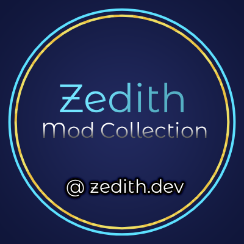

# Zedith

**Zedith** is a modular Hytale modding mono-repository containing a growing collection of focused, high-quality mods and
shared libraries.

Each module is designed to be:

- **Small & purpose-built**
- **Composable with other mods**
- **Performant and ECS-friendly**
- **Independently released on CurseForge**

This repository exists to keep shared tooling, formatting systems, and gameplay mods evolving together without becoming
tightly coupled.

---

## 🎮 Gameplay Mods

### 🎉 PartyChat

[](https://www.curseforge.com/members/lidtop/projects/partychat)
[](./mods/partychat)
[](https://www.curseforge.com/members/lidtop/projects/partychat)
[](https://www.curseforge.com/members/lidtop/projects/partychat)
[](https://www.curseforge.com/members/lidtop/projects/partychat)

A party-based chat and messaging system built on top of Hytale’s ECS and messaging APIs.

- Party-scoped chat channels
- Clean, predictable command structure
- Integrates with **GlowText** for rich formatting
- Designed to be extended by other mods

---

## 📚 Libraries

### ✨ GlowText

[](https://www.curseforge.com/members/lidtop/projects/glowtext)
[](./mods/glowtext)
[](https://www.curseforge.com/members/lidtop/projects/glowtext)
[](https://www.curseforge.com/members/lidtop/projects/glowtext)
[](https://www.curseforge.com/members/lidtop/projects/glowtext)

A tiny, fast text-formatting engine for Hytale messages.

- Named and hex colors: `{blue}text{/blue}{#453}text{/#453}`
- Bold, italic, monospace styles (with shorthands): `{bold}text{/bold}{m}text{/m}`
- Nested and mixed formatting: `{red}{bold}red and bold{/red} just bold{/bold} no styling`
- Links: `{link:https://example.com}click here{/link}`
- Custom color resolvers: Map arbitrary color names to hex values at parse time
- Customizable: The style tag characters (start `{` and end `}`), colors, and default applied styles can be
  set per-parse.
- Graceful fallback: Unknown or unmatched tags are emitted as plain text rather than failing
-

### ⚙️ Configure

[](https://www.curseforge.com/members/lidtop/projects/configure)
[](./mods/configure)
[](https://www.curseforge.com/members/lidtop/projects/glowtext)
[](https://www.curseforge.com/members/lidtop/projects/glowtext)
[](https://www.curseforge.com/members/lidtop/projects/glowtext)

A all-in-one config editing UI.

---

## 🧱 Repository Structure

```markdown
zedith/
├─ mods/
│ ├─ glowtext/
│ └─ partychat/
│ └─ configure/
│ └─ ...
├─ imgs/ # README assets
├─ build.gradle.kts
└─ ...
```

- Gradle multi-project build configured at [build.gradle.kts](./build.gradle.kts)
- JUnit 5 for testing
    - Example tests [GlowTest.java](./mods/glowtext/src/test/java/dev/zedith/glowtext/GlowTest.java)
- Respects Hytale ECS lifecycle and plugin classloader boundaries
    - Dispatch events rather than synchronous execution
- Shared logic lives in libraries, not duplicated across mods

---

## 📜 License

[LICENSE](./LICENSE)

---

## Credits

- Hytale server downloader integration adapted from
  [faststats-dev/dev-kits](https://github.com/faststats-dev/dev-kits/tree/1881337f212cb16b9832162e4e6cf2018a82beb8/hytale).

---
