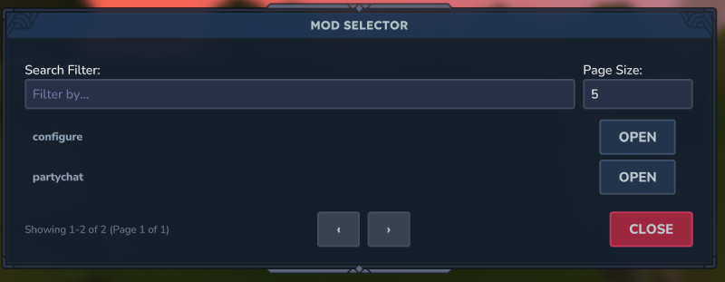
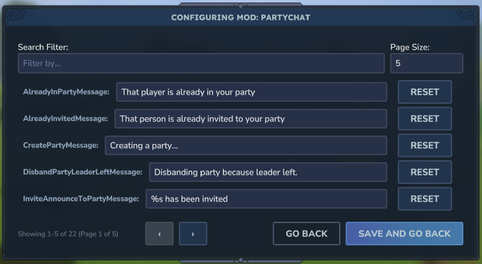
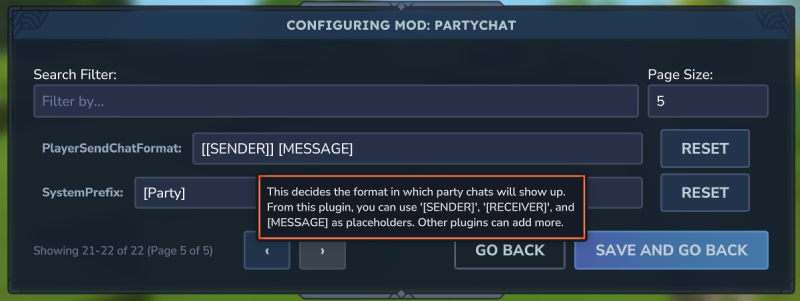

# Configure

Configure parses a given codec for a config and generates a UI for that codec. To use it, just wrap your config in this
plugin's WrappedConfig class and register it. You should only access your config via this wrapped config. E.g.

```
wrappedConfig = new WrappedConfig<>(
        PartyConfig.CODEC,
        withConfig(PartyConfig.CODEC),
        new ConfigMetadata("PartyChat")
);
registerConfig(wrappedConfig);
```

Then, users will see your mod show up when they run /config.



Editing a mod looks like



You can add documentation to your codec entries so that they show up as a tooltip. E.g.

```
.append(
        new KeyedCodec<>("PlayerSendChatFormat", BuilderCodec.STRING),
        PartyConfig::setPlayerSendChatFormat,
        PartyConfig::getPlayerSendChatFormat
).documentation("This decides the format in which party chats will show up. From this plugin, " +
        "you can use '[SENDER]', '[RECEIVER]', and [MESSAGE] as placeholders. Other plugins can " +
        "add more.")
.add()
```

Which will show up like



> Note: Instead of accessing the config directly, you should use the WrappedConfig#read method. E.g.

```
config.read(c -> c.getSystemPrefix())
// or
config.read(PartyConfig::getSystemPrefix)
```

This ensures you are accessing the config in a thread safe way. If the config is saved, the plugin will safely use the
new values.